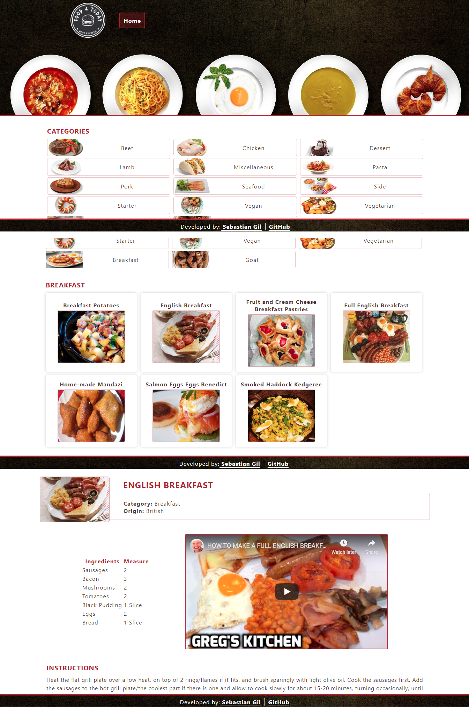

# Food 4 Today

This is a React web application where you can navigate through different food categories and get the recipe for any of them, along with a video tutorial, ingredients, and instructions. Each recipe is loaded with a URL displaying the recipe ID.

Based on the [Catalogue of Dog Clothes](https://www.notion.so/Catalogue-of-Dog-Clothes-8bf1512b8ab34fa28848beb8ab698a32) project specifications.

## Live Demo

[View Live Demo](https://foodfortoday.herokuapp.com/)

## Screenshots

## Video Presentation

PENDING

## Features & Usage

- A list of available food categories is displayed initially.
- You see a list of recipes within a selected category.
- When a recipe from the results is clicked a new component with the recipe details is loaded. The URL changes and will include the recipe ID.
- In the recipe view, you have the name of the recipe, its origin, ingredients and quantities, a video tutorial, and written instructions.
- You can navigate back to the home page, and still see the previously selected category.
- Design is partially responsive although not completely optimized for smartphones.

## Potential Features

- Filter by ingredients.
- Add layout for smaller devices.
- Search by dish name.

## Setup

1. Clone this repository and access the project's directory.
2. Run "npm install".
3. Run "npm test" to run the tests.
4. Run "npm start" to work on the development server.

## Built With

- JavaScript/ES6
- Jest
- React
- React Hooks
- React Router
- Redux
- React Redux
- Heroku

## Author

👤 **Sebastian Gil Rodriguez**

- Website: [sebgil.me](https://sebgil.me)
- Github: [@sebGilR](https://github.com/sebGilR)
- Twitter: [@sebGilR](https://twitter.com/sebGilR)
- Linkedin: [sebastiangilrodriguez](https://www.linkedin.com/in/sebastiangilrodriguez)

## 🤝 Contributing

Contributions, issues and feature requests are welcome!

Feel free to check the [issues page](https://github.com/sebGilR/food4today/issues).

## Show your support

Give a ⭐️ if you like this project!
